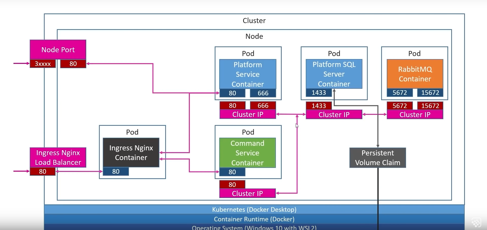
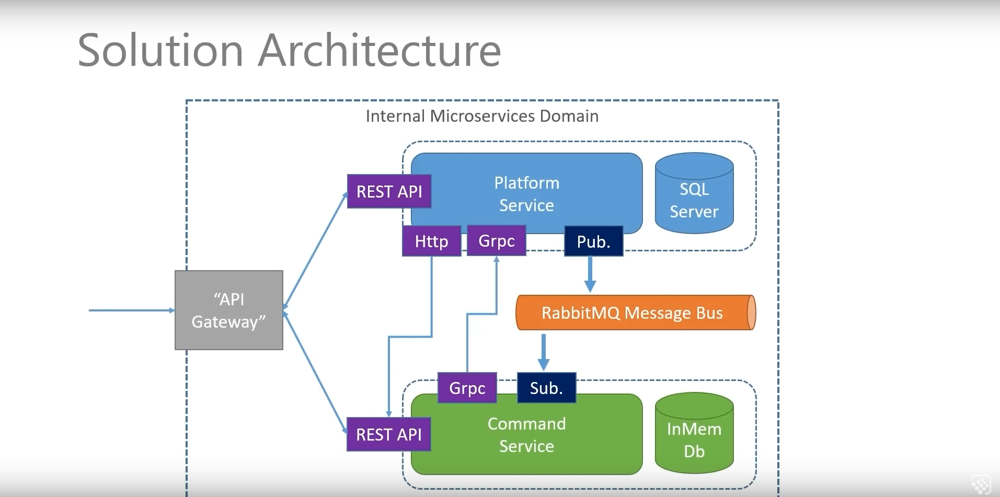
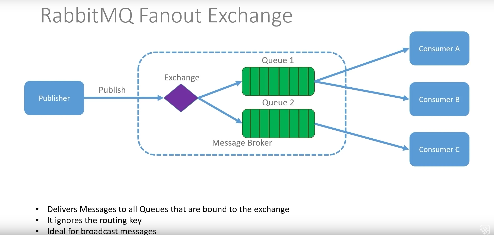
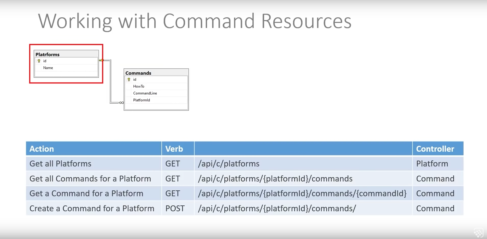
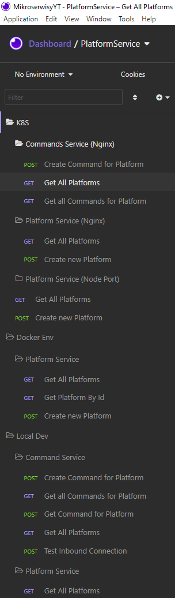

# Microservices Structure

## Table of Contents
* [General Info](#general-information)
* [Technologies Used](#technologies-used)
* [Features](#features)
* [Screenshots](#screenshots)
* [Project Status](#project-status)
* [Contact](#contact)

## General Information
Communication between CommandsService and PlatformService. Using Http/Https/gRPC/RabbitMQ. All services are on Docker.

## Technologies Used
- ASP .NET Core
- Entity Framework
- MSSQL
- In Memory Db
- gRPC
- Docker
- Kubernetes K8S
- Microservices
- AutoMapper

## Features
- Comunicate between two services using Http/Htpps/gRPC
- Returning list of Platforms or Services
- Returning Platofrms/Services by Id

## Screenshots

## Project Status
Project is: _complete_ 

## Contact
Created by [@ITKwiatek](https://github.com/ITKwiatek/) - feel free to contact me!
